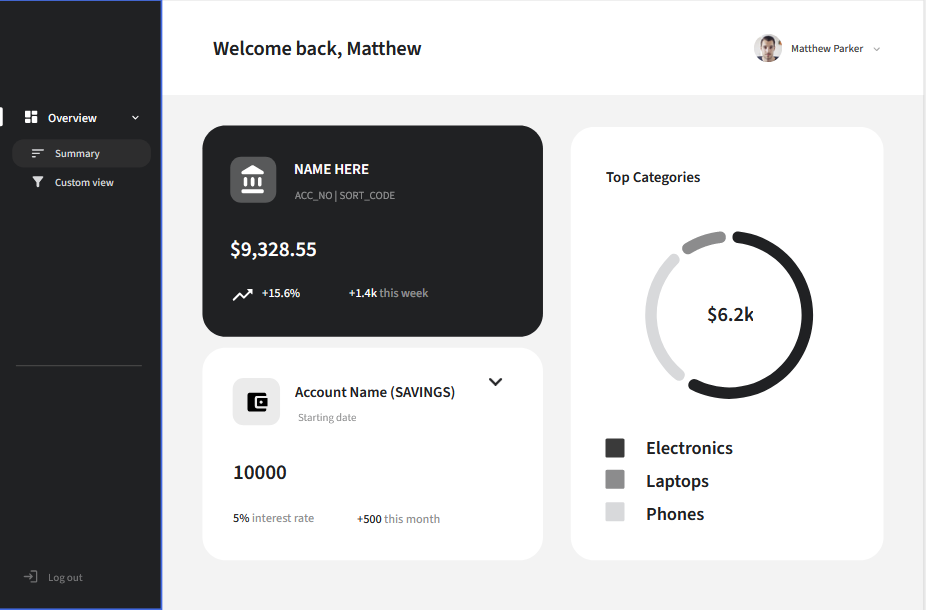
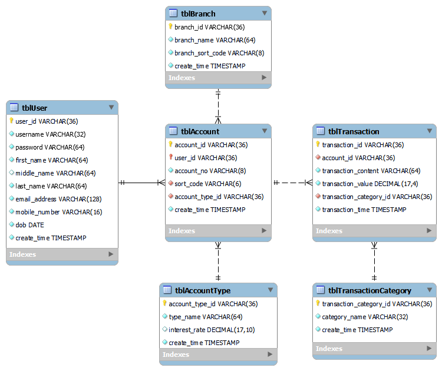

# **Week 1** \~ 30/01 - 05/02

This week was not a very productive week but that was as expected. The assignment just got released on Wednesday, and so the main part of this week was spent thinking about what project to do.

From the beginning I had a feeling that I would want to work collaboratively with people from the course rather than online on an open source project. I had found a group of people to work with quite fast due to working with them on another coursework so that worked out well.

We all shared a similar interest which was we wanted to learn *TypeScript* and so it didnt take long for us to start brainstorming ideas.

We came up with a short list of ideas:
- VS-Code Extension
- VR Application
- P2P Messenger using Typescript
- Something using image recognition
- Split into two groups, one group creating a virus and another creating a detector

After coming up with this vague list, we decided it would be best to break off for the weekend to have some to reflect and potentially come up with better ideas in the following week.

We organised to meet up tomorrow (Monday 6th) after our ADS lecture in the morning.

# **Week 2** \~ 06/02 - 12/02

Following the weekend break, we all came to the conclusion that we were definitely going to be doing something to do with TypeScript and came up with a few more TypeScript related ideas which were:
- Mock banking system + database
- TypeScript or New Framework

From this list we chose the 2 projects which were most promising and they were:
- P2P Messenger using Typescript
- Mock banking system + database

We decided that the Mock banking system was the more promising project as it would allow us to learn and use a larger variety of technology.

Now that the project was decided, we established a relatively clear plan of action:
- Week 3
    - Learn TypeScript and certain technologies using typescript e.g. npm, VS-Code 
- Week 4:
    - Create front end
    - Learn basics of SQL
- Week 5:
    - Make an entity relationship diagram (ERD) for database
    - Start making backend
    - Learn specific functions of SQL related to our needed functionality
- Week 6
    - Complete backend and login system
- Week 20:
    - Polish front end
    - Fix bugs

... and set some goals for our project:
1. Learn TypeScript
2. Learn SQL
3. Write legible code with comments that any coder could understand
4. Create a functional website linked to a database
5. Create a login system for the website

Now that we had a plan and goals, we decided to create an organisation on GitHub and we named it [LMC-Enjoyers](https://github.com/LMC-Enjoyers). 

We finished off our meeting and agreed that next week's focus should be on learning TypeScript.

# **Week 3** \~ 13/02 - 19/02

I started the week by starting to learn TypeScript.
My first google search was 'learn typescript' and it led me to a free [codeacademy](https://www.codecademy.com/learn/learn-typescript) course which very quickly introduced me to the language.
Things I learnt:
- Basic syntax of TypeScript
- How to transpile TS to JavaScript
- Benefits of type-safety which was a familiar concept to me due to being proficient with Java.
- Uses of the .tsconfig file
- Parameter annotations
- Return types
- How to write documentation for TS functions

Overall this course was quite nice, but it felt like the learning was too slow so didnt end up finishing it. It felt much like a playground for learning TS in a fun way.

I decided to switch up the pace by going to the official [TypeScript documentation](1https://www.typescriptlang.org/docs/handbook/typescript-in-5-minutes-oop.html) which had a dedicated guide for people learning TS with a background in a statically typed language like Java.

This was actually a really interesting read, and it highlighted two main things:
- TypeScript treats types as sets of values that share something in common
- The type system is fully erased at runtime.

e.g. If you had two interfaces and two log functions:
```TypeScript
interface Car {
    speed: number;
    wheels: number;
}

interface Bird {
    name: string:
    wings: number;
}

function logCar(c: Car) {
  console.log("speed = " + c.speed + ", wheels = " + c.wheels);
}
 
function logBird(b: Bird) {
  console.log("name = " + b.name + ", wings = " + b.wings);
}
```
and a custom object `obj`
```TypeScript
const obj = {
    name: 'Boeing 737-700',
    speed: 828,
    wheels: 3,
    wings: 2
};
```
then these two function calls will surprisingly work
```TypeScript
logCar(obj);
logBird(obj);
```
because `obj` has properties from both interfaces so it can be treated as those interfaces.

> The relationships between types are determined by the properties they contain, not whether they were declared with some particular relationship.

Additionally, if you had a class called `Car`
```TypeScript
class Car {
    wheels: number;
    speed: number;
    drive() {
    }
}
```
then the result of calling
```TypeScript
typeof (new Car())
```
will be `"object"` and not `Car` or `"Car"`

During the week, me and my team also updated our timeline to include what our current progress was and it was in line with our plan

# **Week 4** \~ 20/02 - 26/02

This week we created a git repo in our organisation and assigned each person their roles.

We also met up on Wednesday for a short meeting and made a few key points:
- Just learning Typescript is not enough
- Decided to use a new framework - React
- Switch from using a SQL server to SQLite which is more appropriate for a small project like ours and is more portable which allows for independent development.

We created the group's repository in our organisation on Github and spent some time tweaking everyone's permissions so that changes would be made by create pull requests.

We also collaborated together on a discord call and created a mockup of our UI/UX design for the website.


Next week, our plan is to start working on actually implementing this mockup using React and Typescript into a working prototype. This plan may be a bit ambitious though due to other coursework potentially affecting the workflow.

# **Week 5** \~ 27/02 - 05/03

This week was busy just as expected, and not much was really done towards the project.
I was mainly consumed by my CT coursework trying to optimise my SAT solver for the SAT race (which fortunately was very successful).

Over the weekend a few people in my group started to work on the front-end implementation of the website, which turned out okay. The website matched the mockup really well, but it was really unresponsive and didn't accomodate for different viewports at all. As a group we decided to postpone front-end for some time and to focus on other components of the app.

In the next week I will focus on improving my knowledge in TypeScript and developing a way for our app to interact with a back-end SQLite database.

# **Week 6** \~ 06/03 - 12/03

This week was extremely busy due to 2 other assignments being due, but I found some time throughout the week and over the weekend to begin designing the website's database.

I began by designing a model of the database using MySQL Workbench which I was familiar with from A-Level. This allowed me to quickly and efficiently design an ERM of the database

This ERM included all the data fields that I thought our website would store and I proposed it to my group in our group chat. They proposed some small changes which I included in the final ERM:



Besides solidifying my skills in ERM design and using MySQL workbench, I also improved in effectively communicating with my group by explaining some of my design choices and listening to feedback.

Nothing has really changed in relation to our group's goal of creating this website, but personally I think I would like to focus solely on one aspect of the website and improve my skills in the area as much as possible instead of learning how to do everything at a very low level.

I think I will propose this idea to my group next week where we all split up and focus on different areas and then in the final weeks link everything together. Whilst proposing this idea, I believe I should underline the importance of us still communicating in order to still have a broad understanding of how everything is working otherwise we might face compatibility issues later down the road.

Next week I will focus on implementing this ERM in SQLite with some very basic initial functionality.

# **Week 7** \~ 13/03 - 19/03

I proposed my idea of working on separate areas of the project to my group and we all collectively agreed that it would be best.

This week, I entirely focused on implementing the database in SQLite and writing some code to interact with the database.

To do this, I had to install precompiled binaries from [SQLite](https://www.sqlite.org/download.html) and place extract them into my PATH directory.

An issue I encountered early in the week was that my DDL (Data Definition Language) script was made for a MySQL server and not a SQLite database, hence there was a compatibility issue.

My initial solution to this issue was to use a converter to create an equivalent SQLite database. I ended up using [DBConvert]ma were ever be updated then this process of converting w(https://dbconvert.com/mysql/sqlite/). This worked and the database was created, but it felt like a very 'tacky' solution. In theory, if the database scheould have to be done again.

This method just 'felt' wrong and so I spent some time researching and found a Object Relational-Mapping package called [TypeORM](https://typeorm.io/), which not only made it super easy to create the database but also made connecting to it very easy. The rest of the week was spent researching the different features of this package and the most suitable implementation for our project.

My personal goals for this project changed to:
- Learning TypeScript to a comfortable level
- Learning TypeORM
- Producing clean, scalable and easily understandable code

Next week I will focus on creating a basic implementation using TypeORM.

# **Week 8** \~ 20/03 - 26/03

This week I focused on using TypeORM to create an extremely basic implementation of the database working. I started off by reading some articles about how to get the implementation working and began creating entity models for each entity.

The process of creating the entity models was quite repetitive as it was just copying the ERM into a TS representation so the whole process went quite smoothly.

I also realised that the database needs to be initialised before it can be accessed and so I made an overall controller file to manage all the operations in the database.

At this point in time I don't have any data in the database but I can add mock data at a later point in time when the methods for interacting with the database have been implemented.

The goal for next week is start writing the remaining methods for interacting with the database.

# **Week 9** \~ 27/03 - 02/04

I started off the week by coming back to my code and realising that none of it was actually working. The issue was that since I had no data in my database, I falsely thought that my implementation was working as it was returning `{}` when I was querying all records in the database.

I spent roughly the first two days this week just researching what the issue could be and eventually discovered that the articles I was using were outdated and were using deprecated methods. This led to compatibility issues.

This was really demotivating and at one point I messaged my group asking for someone else to try and get a basic version of the database working just in case I don't get mine working in time.

However, soon after messaging I had realised that TypeORM had official docs for the recommended way to use their library. In hindsight, this should've been the first thing I used but for some reason I went straight to articles.

Following this silliness, I used the documentation to quickly get a working implementation created and it finally worked. I spent the remainder of the week trying to simplify my implementation and making sure the database is initialised correctly.

The two main things I did were:
- Create a `BaseController` class which every other controller would `extend` from which removed a lot of redundancy in the codebase. This is because all the controller had the similar base functionallity such as:
    - Querying all records
    - Inserting an record
    - Fetching a specific record by ID
    - etc.
- Create a method called `ensureInitialisedDB` which would be run every time before executing any command on the database. This was done because the database initialisation is an asynchronous function and so it is important that the database finishes initialising before any operations are performed.

I also created an example file of how to interact with the database. This would allow members of my group to start using the database in their sections of the codebase, mostly in the API.

Next week I will focus on refining the database code and adding many more methods for interacting with the database. Most of these will be created according to what the API needs to function.

# **Week 10** \~ 03/04 - 09/04

In this week, the main things I did were:
- Refined the code to be more readable for all the members in my group.
- Add more methods for interacting with the data in database
- Create a `BaseEntity` class which all the other entities would `extend` from to reduce redundancy.
- Create a few endpoints in the API.

Most of this was really simple and I found it genuinely enjoyable, which was a nice change compared to the previous week.

This week was quite uneventful for me since my part of the project was already done and fully working and so I spent the majority of the week helping out other members in my group link the backend to the frontend in the server.
