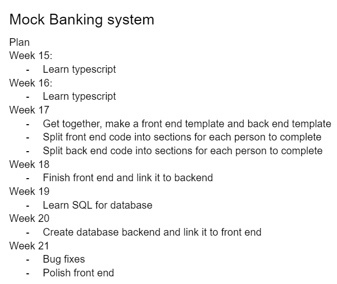
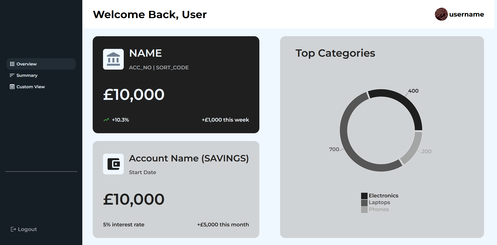
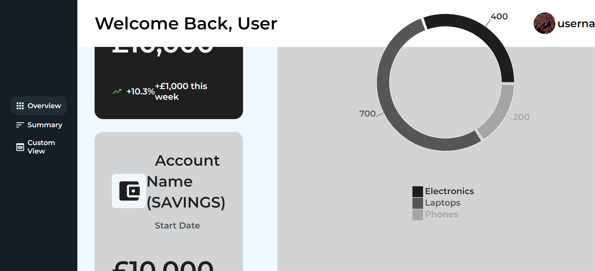
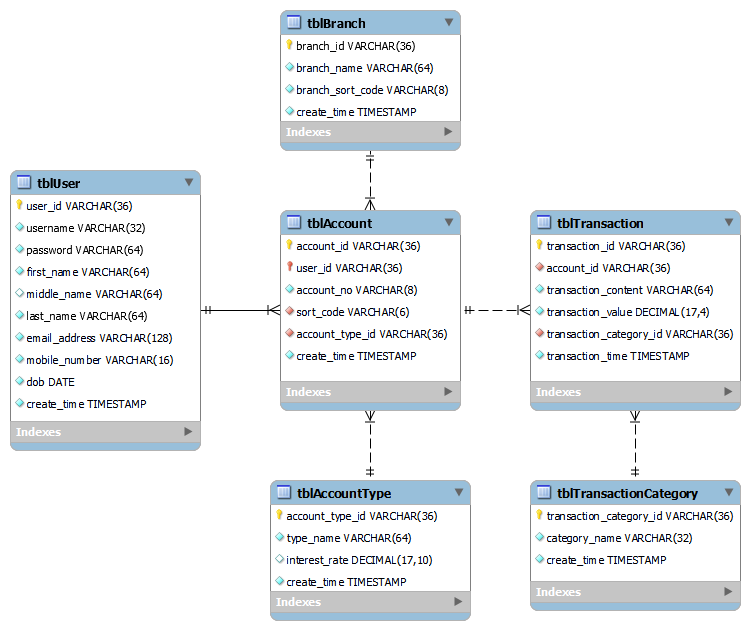

# **Week 1**

This assignment was released on Wednesday, and so the majority of the week was spent thinking about what to do for it.

I knew right away that I wanted to work collaboratively with people from my course rather than an open-source project. I swiftly established a group due to working with them on another coursework.

We all shared a similar interest which was to learn TypeScript, so it didn't take us long to start brainstorming ideas.

We came up with a list of ideas:
- VS-Code Extension
- VR Application
- Typescript-based P2P Messenger
- Image recognition software
- Split into two groups, one group creating a virus and another creating a detector

We decided it would be best to take a break for the weekend to have some time to reflect, and perhaps come up with better ideas in the following week.

We organized to meet up tomorrow (Monday 6th) following our morning ADS lecture.

# **Week 2**

Following the weekend break, we came to the conclusion that we were definitely going to do a TypeScript project.

We came up with more TypeScript-related ideas:
- Mock banking system + Database
- New Framework

We decided that the Mock banking system was the more promising project as it would involve a larger variety of technology.

Once the project ideas was decided, we established a relatively clear plan:

... and set some goals for our project:
1. Learn TypeScript
2. Learn SQL
3. Write legible code with comments that any programmer could understand
4. Create a functional website linked to a database
5. Create a login system for the website

We also created an organization on Github and named it [LMC-Enjoyers](https://github.com/LMC-Enjoyers). 

We finished our meeting in agreement that we should begin learning Typescript next week.

# **Week 3**

Due to prior experience with Java, I had a vague, novice understanding of what TypeScript was already.

After searching 'learn typescript' I arrived at a free [codeacademy](https://www.codecademy.com/learn/learn-typescript) course, which quickly introduced me to:
- Basic syntax of TypeScript
- Transpiling TypeScript to JavaScript
- Benefits of type-safety
- Purpose of the .tsconfig file
- Parameter annotations

Overall, this course was beneficial, but I didn't finish it because the learning was too slow as I prefer densely packed learning guides.

This prompted me to go to the official [TypeScript documentation](https://www.typescriptlang.org/docs/handbook/typescript-in-5-minutes-oop.html) which had a dedicated guide for people with prior experience in statically typed languages.

From this, I learnt two important things:
- TypeScript treats types as sets of values that share something in common
- The type system is fully erased after transpilation and therefore unavailable at runtime.

During the week, my team and I updated our timeline and it was in line with our plan.

Next week, we plan to meet up to create an initial design for the website.

# **Week 4**

We met up on Wednesday for a short meeting and raised a few key points:
- Learning Typescript is not enough
- Decided to also learn React
- Switch to SQLite which is more appropriate for a small project due to increased portability.

We created a git repo in our organization, assigned roles and updated everyone's permissions.

We collaborated together on a discord call and created a mockup of the UI/UX design.

Our plan for next week is to create a working prototype of the frontend. Due to other coursework, this plan is quite ambitious.

# **Week 5**

This week was busy for me as expected, so I couldn't do much towards the project.

Over the weekend, a few people in my group started to work on the front-end implementation of the website:

The website matched the mockup well, but it was unresponsive and didn't accommodate for different viewports :
 

We decided to postpone frontend development indefinitely to focus on other parts of the app.

Next week I will focus on improving my knowledge in TypeScript and implementing an SQLite database.

# **Week 6**

Due to 2 other assignments, this week was extremely busy, but I found time over the weekend to design the website's database.

I designed the database's ERM using MySQL Workbench. I showed it to my group and they proposed some small changes which I included in the final ERM:

Besides solidifying my skills in ERM design, I improved my communication skills by explaining my design choices and listening to feedback from my group.

Our group's goal is unchanged, but personally I think I would prefer to improve my skills in one aspect of the website instead of learning how to do everything at a low level.

Next week, I will propose an idea to split up and focus on different areas, then link everything together in the final weeks. I will need to emphasize the importance of communication otherwise we might face compatibility issues later.

Next week I will try to implement this ERM in SQLite with basic functionality.

# **Week 7**

This week, I focused entirely on implementing the database in SQLite.

To do this, I had to install precompiled binaries from [SQLite](https://www.sqlite.org/download.html) and extract them into my PATH directory.

An issue I encountered early on was that my DDL script was made for a MySQL server and not SQLite, hence there was a compatibility issue.

My first solution was using a converter to create an equivalent SQLite database. I ended up using [DBConvert](https://dbconvert.com/mysql/sqlite/). This worked, but it felt like a 'tacky' solution. In theory, this process would have to be repeated any time the database schema were changed.

After researching, I found an Object Relational-Mapping package called [TypeORM](https://typeorm.io/), which made it easy to create the database and connect to it. I spent the rest of the week researching the package's features and implementations

My goals changed to:
- Learning TypeScript to a comfortable level
- Learning TypeORM
- Producing clean, scalable, and understandable code

Next week, my focus is to implement the database using TypeORM.

# **Week 8**

I started off the week by reading some articles about how to implement the database using TypeORM. Most importantly, I had to create entity models for each entity, which was repetitive so the process went smoothly.

I made a controller to manage database initialization and all database operations. Currently, the database stores no data but mock data can be added later when DML methods have been implemented.

The goal for next week is write the DML methods.

# **Week 9**

Upon coming back to my code, I realized that it never actually worked. The issue was that, since I had no data in my database, I falsely thought that my implementation was working as it was returning `{}` when I was querying all records in the database.

I spent days researching the underlying issue and eventually concluded that the articles I had used were outdated and used deprecated methods, which led to compatibility issues.

This was really demotivating. At one point I asked for someone else to do the database just in case I could't get mine to work on time. However soon after saying that, I had realized that TypeORM had official documentation. In hindsight, this is blatantly obvious, but for some reason I initially avoided the documentation and instead used only articles.

Following this realization, I spent the rest of the week reading the documentation and trying to implement the database correctly. I also had enough time to simplify my working implementation.

The two main things I did were:
- Made all controllers `extend` from a `BaseController`, which removed a lot of redundancy due to all controllers having similar base functionality:
    - Querying all records
    - Inserting an record
    - Fetching a record by ID
- Create a method `ensureInitialisedDB`, which would run before any request sent to the database. This was done because the database initializes asynchronously, hence it is important that the database finishes initializing before any operations are performed.

I also created an example file of how to interact with the database to make it clear for my group.

Next week I will focus on refining the database code and adding the remaining DML methods according to what the API needs.

# **Week 10**

This week, I did the following:
- Refined code to improve readability.
- Added more DML methods
- Added a `BaseEntity` to further reduce redundancy
- Created more endpoints in the API.

This week was quite simple and genuinely enjoyable, which is a nice change compared to last week.

Since my part of the project was done, I spent the majority of the week helping my group link the backend to the frontend.

# **Reflection**

I have learnt many skills from this project, which include:
- Planning, communication & organisation in a group
- Creating a database for an application.
- Writing simple, scalable code with very little redundancy.
and most importantly learning TypeScript.

These skills should be very useful in the future, furthermore, TypeScript has become quite a popular language, so I might need it in my career.
